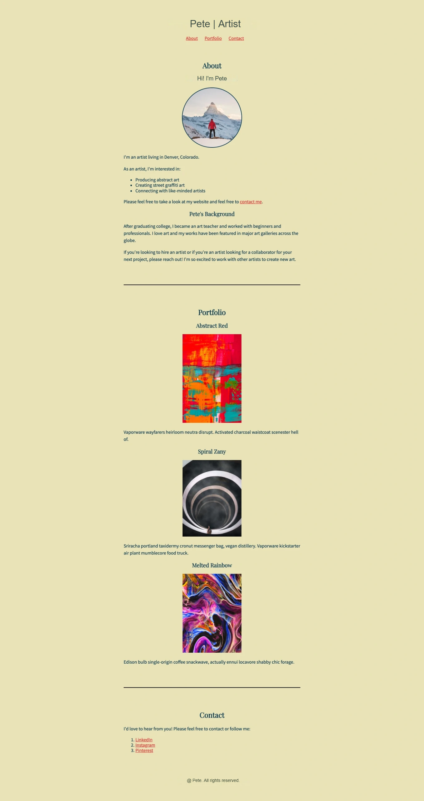
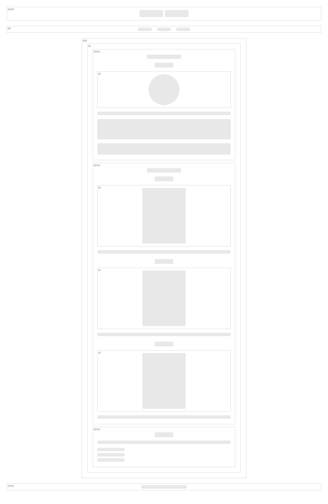
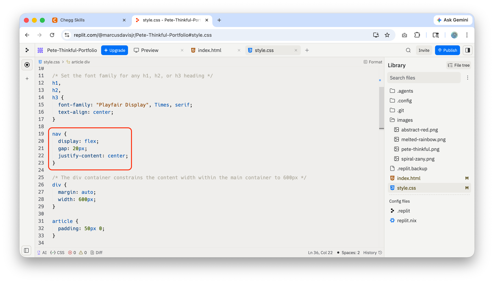
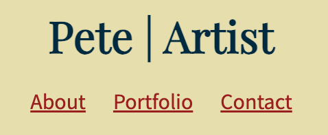
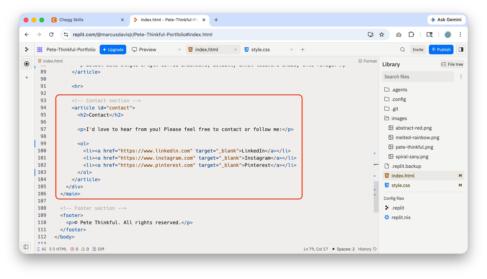

# pete-portfolio
Pete Thinkful's Portfolio website


## Project Description
The project is a hypothetical single page web portfolio for an artist named Pete. It contains an about section, a portfolio section displaying three pieces of art, and a contact section with a listing of the artist's social media presence. It was built using basic HTML/CSS that was coded with Replit.com.


## Design & Implementation Process

### Implementation Plan: 
1. Used Figma to build a wireframe to plan the overall structure of the page using the mockup provided in the lesson for reference.
2. Identify colors and fonts specs to use for the page.
3. Use Replit to code the .html starting with the container structure first, then coding the content in the appropriate sections.
4. Apply the approprate styling with .css.
5. Use Gemini and W3C Markup Validation Serivce to validate and debug code.

### Provided Mockup: 


### Wireframe: 


### Colors:
* Background color: `#eae2b7`

* Text color : `#003049`

* Link color: `#d62828`

* Link hover color: `#a42323`

* Horizontal line: `black`


### Fonts:
* Body font: `Source Sans Pro, Tahoma, Geneva, Verdana, sans-serif`

* Header font: `Playfair Display, Times, serif`

 
## Design Trade-offs
This is a very simple single page website, so there were no major trade-offs that I needed to make in the design to fulfill the requirements of the project.


## AI Tool Disclosure
**Google Gemini:** Used for assistance with code debugging and general learning.

**Replit AI:** Used for inline code suggestions and autocomplete for efficiency gains.


## Development Journey

### Key Decisions
1. Each of the three main sections of the page have been placed in semantically significant `<article>` container as this information could be suitable to be referenced on other websites.
2. I felt that spacing needed to be added in between the items in the navigation, so I applied the following styling to the `<nav>` container:
```css
nav {
  display: flex;
  gap: 20px;
  justify-content: center;  
}
```
   
### Challenges & Debugging
I encountered a bug where the text that was inside of the Portfolio section of the page was not wrapping within the confines of the `<main>` container. I used Google Gemini to analyze my code and it discovered that the text I input into the code contained `&nbsp;` characters that were preventing the text lines from breaking and wrapping appropriately. I replaced the text and it fixed the issue.  


## Process Documentation

### GitHub Commit History
(https://github.com/marcusdavisjr/pete-portfolio/commits)

### Replit Development Screenshots
**Navigation Spacing**




******

**Content Section in  `<article>` container**

